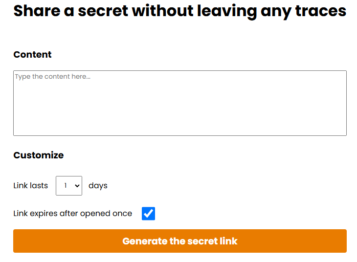

# OneTimeShare
## Share your secret securely
- You write your secret
- You select its expiration date and if it can only be used once
- You generate the unique link
- You share it with who you want
- He opens it and has access to your secret

The secret will be automatically removed after being read (if once setting has been set), otherwise it will be removed when arrived at the expiration date.

