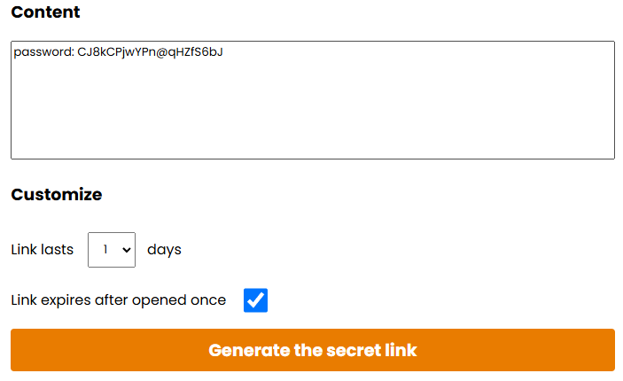

# OneTimeShare
## Share your secrets securely

1. You write your secret, you select its expiration date and if it can only be used once, and you generate the unique link

2. You share it with who you want

. The other user opens it

4. He has access to the secret

5. The secret will be automatically removed after being read (if once setting has been set), otherwise it will be removed when arrived at the expiration date.

