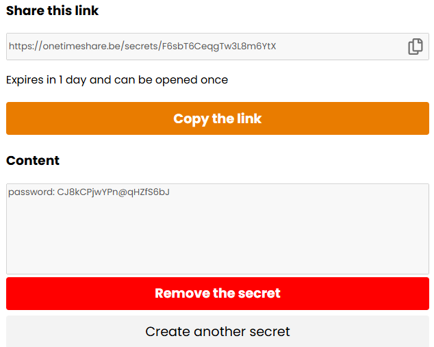
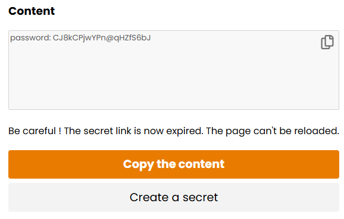
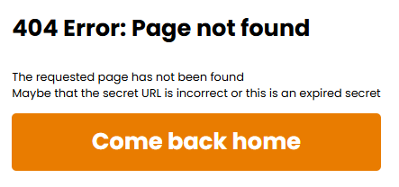

# OneTimeShare
The role of this web application is to allow two users two share secrets securely and easily, over internet.

## The problem

Employees often need to share secrets within a company. However if they do not have a access to a shared password manager solution. So it can be hard for them to share confidential information securely. This often leads to password, API key or other secrets being shared on Teams, through mail etc. This is a <b>security issue</b> since anyone accessing your Teams or mail account get to access these information.

Same problem occurs when dealing with external companies when you need to share a secret with them, whether it is to share a password, an IPSEC key, an x509 certficate etc.

## The solution

One simple solution to this problem is <b>OneTimeShare</b>. It allows you to create a secret stored in a temporary link that will automatically expries after some time, and after being opened once. This means that anyone accessing your Teams account or email would only have access to an expired link, leading to nothing.

## How it works

<b>Step 1:</b> You write your secret, you select its expiration date and if it can only be used once, and you generate the unique link

  

<b>Step 2:</b> You share it with who you want

  

<b>Step 3:</b> The other user opens it

  

<b>Step 4:</b> He has access to the secret

  

<b>Step 5:</b> The secret will be automatically removed after being read (if once setting has been set), otherwise it will be removed when arrived at the expiration date.
   

## Technologies

